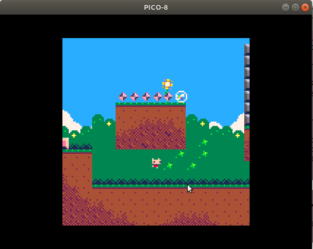

# Warm up

## Installation de pico8

Exemple sous Linux : on extrait l'archive à la racine de son répertoire personnel puis on exécute le programme `pico8`. On note ici que le répertoire `.lexaloffle` n'existe pas encore. Les explications complètes se trouvent dans le fichier `pico-8.txt`.

```bash
$ cd $HOME
$ ls pico-8
ls: cannot access 'pico-8': No such file or directory
$ unzip pico-8_0.1.11g_amd64.zip 
Archive:  pico-8_0.1.11g_amd64.zip
   creating: pico-8/
  inflating: pico-8/pico-8.txt       
  inflating: pico-8/pico8.dat        
  inflating: pico-8/pico8_dyn        
  inflating: pico-8/lexaloffle-pico8.png  
  inflating: pico-8/pico8            
  inflating: pico-8/license.txt      
$ ls .lexaloffle
ls: cannot access '.lexaloffle': No such file or directory
$ pico-8/pico8
```

Si vous êtes en plein écran, vous pouvez réduire la fenêtre avec <kbd>Alt</kbd> + <kbd>Enter</kbd>


## Installer les cartouches de démo

Suivre les commandes tapées (en minuscules sur votre clavier) dans la console pico8 :


Ensuite il suffit de lancer un jeu avec la commande `RUN` :


Et on joue ici avec les touches <kbd>→</kbd><kbd>↑</kbd> 



Pour sortir du mode `RUN`et voir le code on tape deux fois  <kbd>Esc</kbd>


Et on peut changer de mode d'édition en cliquant sur la barre de menu en haut à droite, par exemple pour aller dans l'éditeur de sprites.


## Exporter le jeu en HTML + JavaScript

Depuis que l'on a installé les démos, le répertoire `~/.lexaloffle/pico-8/`a été créé. 

Entre autres, on y trouve les démos au format p8 :

```bash
$ cd .lexaloffle/pico-8/
$ ls
backup  carts  config.txt  log.txt  sdl_controllers.txt
bbs     cdata  cstore      plates
$ ls carts/
demos
$ ls carts/demos/
api.p8     butterfly.p8  collide.p8  hello.p8    mandel.p8  stompy.p8
bounce.p8  cast.p8       drippy.p8   jelpi.p8  sort.p8    woo.p8
$ 
```

Pour exporter un jeu (ici exemple de jelpi) au format HTML + JavaScript, il suffit de charger le jeu puis de lancer la commande `EXPORT JELPI.HTML`. Il y a un problème de son avec le navigateur chrome qui peut être résolu en suivant les consignes trouvées ici :

Taper `pico-8 audiocontext`  dans votre moteur de recherche puis suivre les liens :

https://www.lexaloffle.com/bbs/?tid=32513

https://www.lexaloffle.com/bbs/?tid=31000

On installe l'archive https://www.lexaloffle.com/bbs/files/13845/ub_html_12.zip dans le dossier `plates`

```bash
$ cd ~/.lexaloffle/pico-8/plates/
$ ls
$ cp ~/Downloads/ub_html_12.zip .
$ unzip ub_html_12.zip 
Archive:  ub_html_12.zip
  inflating: ub.html                 
  inflating: ubm.html                
$ 
```

Enfin on exporte le jeu avec l'option `-P UB`


Les fichiers `jelpi.html`et `jelpi.js`sont créés dans le dossier `demos`

On peut accéder directement à ce dossier avec la commande `folder`


Il ne reste plus qu'à tester le jeu dans un navigateur :


Pour Windows ou MacOS, c'est le même principe.

Bon code!